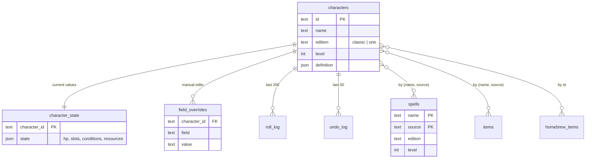

# Data model

Schemas live in code and are the source of truth:
`packages/content/src/schema.ts` for the catalog, `packages/api/src/db/characters.ts`
and `packages/api/src/db/homebrew.ts` for user data, and
`packages/character/src/character.ts` for what the `definition` and `state` JSON columns
hold. This describes the shape and the rules that are not visible in a table definition.

## Shape



## Rules that are not in the schema

**Reference, never copy.** A character stores `{name: "Fireball", source: "PHB"}`. It
does not store the spell. Rebuilding the catalog updates every character; copying would
freeze each character at the moment it was created.

**Homebrew is the exception.** Nothing else owns it, so `homebrew.db` stores full
records. Rows carry source `HB` and are merged with catalog rows at query time.

**Two entities need more than `(name, source)` to identify them.** A feature is keyed by
the class that grants it and the level it arrives at — `(name, source, class_name,
class_source, level)`, and a subclass feature by the subclass as well. Without the class
and the level, `Ability Score Improvement` from `PHB` is one key over 63 rows, spread
across twelve classes and five levels, and a Fighter's sheet resolves to a Barbarian's
feature with nothing to show for it. These are the parts `{@classFeature}` and
`{@subclassFeature}` already carry, so the key is the tag. A deity is the other, keyed by
pantheon as well — held in `lookups.qualifier`, since Tier B shares one table.

**Every content lookup filters on edition.** Both rulesets are present for every class,
spell, and lookup table. A query without an edition filter returns duplicates.

**A subclass carries its own edition, not its class's, and so does a feature.** 120 of
322 subclass rows and 75 of 1,441 subclass feature rows sit under a class variant of the
other edition, because a 2024 class offers the 2014 subclasses alongside its own — a
`one` Barbarian has four `one` subclasses and nine `classic` ones, and the 2024 Cleric's
Death Domain features are still `DMG` rows. So a picker offering only current material
filters on both `class_source` and `edition`, and one offering everything a character may
legally take filters on `class_source` alone. **Filtering a subclass or a feature on
`edition` alone returns the wrong set, not a smaller one.**

**A subclass is joined to its features by `short_name`.** A tag and a
`subclass_features` row both name the Berserker; the `subclasses` row is the Path of the
Berserker. `subclasses.short_name` carries the short form so the join is
`(short_name, source, class_source)` in SQL rather than a `json_extract`.

**Overrides are sparse.** An absent `field_overrides` row means "use the computed
value". Writing an override never changes the computed side, and clearing one restores
the computed value rather than a remembered old number.

**Logs are pruned on insert**, in the same statement that writes the new row. A cron job
or a manual cleanup would be one more thing to forget.

## Resource counters

Class resources come from `classTableGroups` where upstream provides them, which is
about 80% of cases — see [`5etools-data.md`](5etools-data.md). The rest are stored as
generic counters:

```
name          "Superiority Dice"
current       3
maximum       4
resets_on     short | long | dawn | manual
```

The same shape holds data-derived resources and user-invented ones, so Battle Master
dice and a homebrew resource need no special casing.
