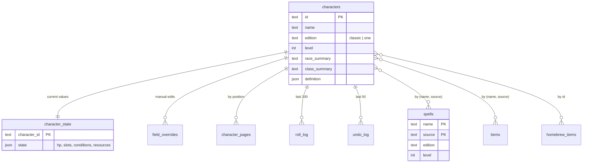

# Data model

Schemas live in code and are the source of truth:
`packages/content/src/schema.ts` for the catalog, `packages/api/src/db/characters.ts`
and `packages/api/src/db/homebrew.ts` for user data, and
`packages/character/src/character.ts` for what the `definition` and `state` JSON columns
hold. This describes the shape and the rules that are not visible in a table definition.

## Shape



## Rules that are not in the schema

**Reference, never copy.** A character stores `{name: "Fireball", source: "PHB"}`, not the
spell. Rebuilding the catalog updates every character; copying would freeze it at creation.

**Homebrew is the exception.** Nothing else owns it, so `homebrew.db` stores full
records. Rows carry source `HB` and are merged with catalog rows at query time.

**A homebrew background or feat's `json` reuses `backgroundRecordSchema`'s and
`featRecordSchema`'s entry shape** from `packages/catalog/src/character-options.ts` —
`name`, `source` and `entries`, with skill proficiencies, prerequisites and everything
else passthrough. The catalog and homebrew sides read the same fields either way, and a
row is written once and displayed, never edited field by field — the same reasoning
`homebrewItemSchema` and `spellEntrySchema` give.

**A homebrew race or class's `json` reuses its catalog record's entry shape**, from
`packages/catalog/src/race.ts` and `class.ts`, and requires what a derived block reads: a
class's `hd`, which `homebrew_classes.hit_die` derives from, and a race's `size` and
`speed`. Neither carries a child row of its own: no subrace until one proves common enough
to need it, no feature rows and no subclass until its own issue adds one — a homebrew
parent has no ETL merge step to build either from. `race`, `levels[].class` and both
feat-grantor branches accept a homebrew reference, so a delete refuses while one is held.

**A homebrew feat cannot be a `granted_optional_features` grantor.** That table lives in
`content.db`, generated wholesale by the ETL and never migrated, so it has no way to
reference a `homebrew.db` row — separate files, no cross-database foreign key, and the
`granted_by` CHECK is fixed at generation time. A homebrew feat's `json` may describe an
outright grant in its prose the same as any other field; it is not read structurally.

**The API enforces a homebrew reference, since the schema cannot.** `characters.db` and
`homebrew.db` are separate files opened as separate connections, so SQLite's foreign keys
never see across them. `routes/homebrew.ts` scans every character's `definition` for the
id a delete names and refuses it, naming the characters holding the reference, rather
than let it resolve to nothing.

**A `homebrew_items` or `homebrew_spells` row's `json` holds the 5etools entry shape**,
not a shape of our own — `packages/catalog` defines it. One renderer then serves the
catalog and homebrew alike, `{@tag}` markup in homebrew text works by construction, and
the query-time merge with catalog rows is a union of like things. The schema accepts the
subset the content loaders and a renderer read — `name`, `source`, `entries`, and the few
fields each entity type derives a row column from — and passes every other field through
unvalidated. A homebrew item or spell is written once and displayed, never edited field
by field, so it needs none of the round-trip guarantee `characterDefinitionSchema`'s
strict objects give a character.

**A merged list tells a homebrew row from a catalog row by shape, not by reading
`source`.** A catalog record carries `source` and no `id`; a homebrew record carries `id`
and `createdAt` and no top-level `source`. `GET /spells` returns a union of the two record
schemas, so a caller tells them apart by which fields are present, not by comparing a
string. The list is bounded, and the response carries the bound as `limit`, `offset` and
`total` rather than leaving the client to assume one.

**Four entities need more than `(name, source)` to identify them.** A feature is keyed
by the class that grants it and the level it arrives at — `(name, source, class_name,
class_source, level)`, and a subclass feature by the subclass as well. Without the class
and the level, `Ability Score Improvement` from `PHB` is one key over 63 rows, spread
across twelve classes and five levels, and a Fighter's sheet resolves to a Barbarian's
feature with nothing to show for it. These are the parts `{@classFeature}` and
`{@subclassFeature}` already carry, so the key is the tag. A subrace is the second,
keyed by its parent too — `(name, source, race_name, race_source)` — since `(name,
source)` collides three times across the 98 upstream writes. A deity is the third, keyed
by pantheon as well — held in `lookups.qualifier`, since Tier B shares one table. A card
is the fourth, keyed by the deck it belongs to, which is what `{@card}` names between the
two: `Balance` from `BMT` is a card in the Deck of Many Things and another in the Deck of
Many More Things. `entities.qualifier` holds it, for the same reason Tier B needs one.

**A subrace row is the race and the subrace merged, not a delta.** Upstream renders the
pair together and states the difference between "add to the race's field" and "replace
it" in the subrace's own `overwrite` map, which only a merge can act on; three dragonborn
subraces go further and revise `Breath Weapon`, a trait the parent alone carries, through
a `_versions` `_mod` that resolves against nothing until the two are one entry. So the
merge runs in the ETL, `subraces.race_name` is provenance rather than a join a reader has
to make, and the race's identity and printing history stay off the subrace — five `PHB` base
variants have no name of their own and would otherwise answer to their parent's. A
character stores the subrace's own pair and its race carries the other two parts of the
key, so those five are the subraces no character names.

**An optional feature's types live beside it.** 9 of 213 are offered under more than one
`featureType` — `Dueling` from `PHB` under all four fighting-style classes — so
`optional_feature_types` holds one row per type and `optional_features` stays keyed
`(name, source)`. A character referencing `Dueling` gets one row however many classes may
take it, and a picker filters by joining.

**An entitlement to optional features is a count, not a list.**
`class_optional_features` and `subclass_optional_features` hold how many options of a
type a level knows; `optional_feature_types` holds which options carry that type. Every
level that may pick carries a row, because upstream states the count either per level or
only at the levels it changes at — so the carry-forward happens in the ETL and a query is
an equality join. An absent row means the level may pick none.

**A grant with no level is the third table.** Four feats and `Superior Technique` grant
options outright, so `granted_optional_features` is keyed `(granted_by, name, source,
feature_type)` — `granted_by` naming the table the grantor is in, since an optional
feature grants as readily as a feat does. A character's total for a type is all three
tables summed, which [`optional-features.md`](optional-features.md) spells out; reading
the class side alone is short by whatever their feats granted.

**A spell's class list is a join, not an entity.** `spell_classes` is keyed
`(spell_name, spell_source, class_name, class_source)` — a spell answers to several
classes and a class to hundreds of spells, so neither pair identifies the row alone.
`data/spells/sources.json`'s `class` and `classVariant` both contribute, collapsed into
one row each: a class either grants a spell or it doesn't, and upstream's split between
the two carries no meaning a query needs.

**Every content lookup filters on edition.** Both rulesets are present for every class,
spell, and lookup table. A query without an edition filter returns duplicates. The pool a
grant reaches is the exception: a character holding a 2014 feat picks from every option
carrying its type, so a total joins `optional_feature_types` unfiltered.

**A subclass carries its own edition, not its class's, and so does a feature.** 124 of
322 subclass rows and 75 of 1,441 subclass feature rows sit under a class variant of the
other edition, because a 2024 class offers the 2014 subclasses alongside its own — a
`one` Barbarian has four `one` subclasses and nine `classic` ones, and the 2024 Cleric's
Death Domain features are still `DMG` rows. So a picker offering only current material
filters on both `class_source` and `edition`, and one offering everything a character may
legally take filters on `class_source` alone. **Filtering a subclass or a feature on
`edition` alone returns the wrong set, not a smaller one.**

**A subclass is joined to its features by `short_name`.** A tag and a
`subclass_features` row both name the Berserker; the `subclasses` row is the Path of the
Berserker. `subclasses.short_name` carries the short form so the join is
`(short_name, source, class_name, class_source)` in SQL rather than a `json_extract` —
the same four parts the `subclasses` key uses, with the short name in place of the full one.
A character stores the full name, because it names a row rather than a join — the level's
own class carries the other two parts, and the short name keys the features instead.

**Overrides are sparse.** An absent `field_overrides` row means the computed value applies.
Writing one leaves it untouched; clearing it restores that value, not a remembered old number.

**`name`, `edition`, `level`, `race_summary` and `class_summary` are recomputed, never
accepted.** All five derive from `characters.definition` — `race_summary` and `class_summary`
from `raceSummary()` and `classSummary()`, reading `Homebrew` for an unresolvable `homebrewId`.

**A preset page is hidden, never deleted.** Each character seeds with Stats, Spells, Inventory
and Features; a write omitting one is refused. Restoring resets the presets and their seeded
order, in their own slots; written pages stay put. The server alone sets `preset`.

**A page is an ordered list of blocks** — `section`, `value` (a derived field and its
breakdown), `list` (a filter, never a row snapshot) or `text` (`{@tag}` markup). An unknown
kind is refused on write; on read it degrades to an `unknown` block a save still keeps.

**Logs are pruned on insert**, in the same statement that writes the new row — nothing to schedule.

## Resource counters

Class resources come from `classTableGroups` where upstream provides them, which is
about 80% of cases — see [`class-tables.md`](class-tables.md). The rest are stored as
generic counters:

```
name          "Superiority Dice"
current       3
maximum       4
resets_on     short | long | dawn | manual
```

The same shape holds data-derived resources and user-invented ones, so Battle Master
dice and a homebrew resource need no special casing.
